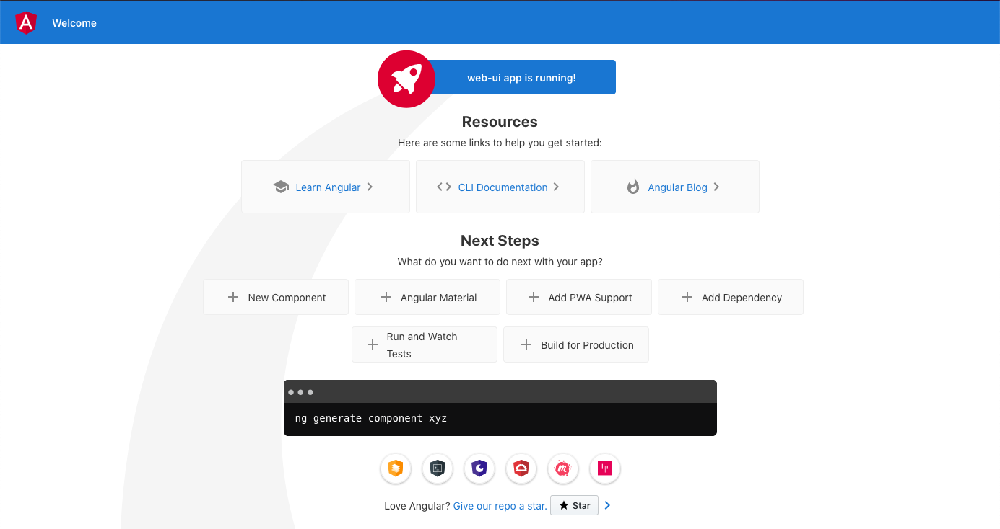

# Docker Tutorial

## Introduction

Docker is a *virtualisation* technology based on the concept of *containers*. It allows its users to bundle together libraries, configuration files and software into isolated blocks that can be run on top of the OS of a machine, without the need for any additional set up.

See the [slides](docker.pdf) in this folder for a quick introduction to Docker concepts and commands.

You can also check the [Docker command line reference](https://docs.docker.com/engine/reference/commandline/docker/) and the [Dockerfile reference](https://docs.docker.com/engine/reference/builder/) to help you with the exercises.

## Exercises

1. Generate a new Angular project called `web-ui` on your machine. Hint: Have a look at the Angular docs to find out how to generate a new Angular project.

2. Create a new `.dockerignore` file in the `web-ui` directory to tell Docker to ignore the `node_modules` directory when building images.

3. Create a new `Dockerfile` in the `web-ui` folder. The Dockerfile should be split into two layers:

    1. In the first layer:
        
        - Use the latest version of [`node`](https://hub.docker.com/_/node/) as a base image and set the layer's name to `build-phase`;
        - Set the layer's workdir to `/webapp`;
        - Copy the `package.json` and `package-lock.json` files from the `web-ui` repository on your machine to the layer's workdir;
        - Run the `npm install` command in the layer to install the dependencies of the Angular application;
        - Copy the contents of the `web-ui` directory from your machine to the layer's workdir;
        - Run the `npm run build -- --output-path=./dist` command in the layer to build the Angular application and output the result in the `./dist` folder.

    2. In the second layer:
        
        - Use the latest version of [`nginx`](https://hub.docker.com/_/nginx) as a base image;
        - Copy the contents of the `./dist` folder from the previous layer to the `/usr/share/nginx/html` directory in the current layer. Hint: the `--from` option allows you to select a stage (layer) from which files must be copied.

4. Try to build a new image with the `Dockerfile` you just created.

5. Run your image in a new container connected to port `80` on your machine.

6. Once you've completed all the steps above, go to [`http://localhost:80/`](http://localhost:80/). You should see the following page:

7. Stop the container you started at step 5.

8. Delete the image you've created at step 4 from your machine.
